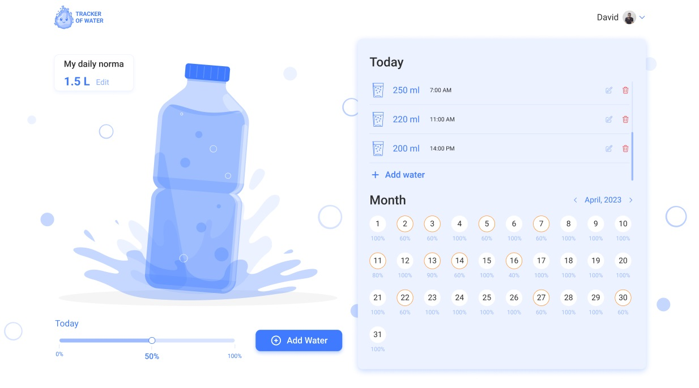

## WaterTracker app


## Description

**WaterTracker is a web application that allows the user to monitor their daily
water consumption. The application has the following functional components: Home
Page, Water Log and Settings. The application is adapted to a desktop, tablet
and mobile phone and has three breaking points - 1440px, 768px, 320px,
respectively.**

## Getting Started

1. Clone the repository:

```
git clone https://github.com/AndreiGutnik/WaterTracker_Frontend.git
```

2. Navigate to the project directory:

```
cd watertracker
```

3. Install dependencies:

```
npm install
```

4. Run the application:

```
npm start
```

## Project Structure

**src**:

- **components**: Reusable React components
- **constants**
- **hooks**: Custom React hooks
- **images**
- **pages**: Components representing individual pages of the application.
- **schemas**: Field validation schemes
- **redux**: Redux Store

## Demo



## Used Libraries

**_Frontend_**

- **React.js**
- **React Router**
- **Redux Toolkit**
- **Redux Persist**
- **React-Toastify**
- **React Spinners**
- **styled-components**
- **Formik**
- **Yup**
- **react-range**
- **date-fns**
- **Axios**

**_Backend_**

- **Node.js**
- **Express**
- **MongoDB**
- **Mongoose**
- **Joi**
- **Nodemailer**
- **Cloudinary**
- **Swagger**

## Swagger

[Swagger API Documentation](https://watertracker-ldwc.onrender.com/api-docs)
